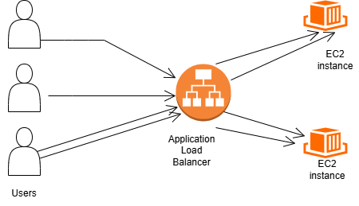

# Day 01 – Cloud Computing: The Big Picture

## Course
Cloud Computing: The Big Picture  
Instructor: David Chappell  
Platform: Pluralsight

## Core Concepts

### What is Cloud Computing?
Cloud computing is the on-demand delivery of computing resources
(servers, storage, databases, networking, software) over the internet
with pay-as-you-go pricing.

### Three main concepts discussed in cloud computing
- **Cloud applications** (Software as a Service)

- **Cloud platforms** (Technologies for running applications, storing data and more)

- **Private clouds** (Running cloud platform in on-premises datacenters)

## Cloud Platform Tecnologies
### 1. Compute
- **IaaS** – Infrastructure as a Service  
  Example: AWS Elastic Compute Cloud (EC2), Azure Virtual Machines and GCP Compute Engine

- **PaaS** – Platform as a Service  
  Example: AWS Elastic Beanstalk, Azure App Service and GCP App Engine

  - **CaaS** – Container as a Service  
  Example: AWS Elastic Kubernetes Service (EKS), Azure Azure Kubernetes Service (AKS) and GCP Kubernetes Engine

  - **FaaS** – Function as a Service  
  Example: AWS Lamda, Azure Functions and GCP Cloud Functions

- **SaaS** – Software as a Service  
  Example: Gmail, Office 365

  ### 2. Data

  - **Object Storage**   
  Example: AWS Simple Storage Service (S3), Azure Blobs and GCP Cloud storage

  - **Relational**   
  Example: AWS Relational Database Service (RDS), Azure SQL database and GCP Cloud SQL

    - **NoSQL**   
  Example: AWS DynamoDB, Azure Cosmos DB and GCP Cloud Bigtable

### Deployment Models
- Public Cloud
- Private Cloud
- Hybrid Cloud
- Multi-cloud

## Why Cloud Matters
- Scalability
- Cost efficiency
- Global availability
- Faster innovation

## Reflection 
As a full-stack developer, cloud allows me to:
- Deploy applications globally
- Automate infrastructure with code
- Focus more on product logic than hardware
- Transition into roles like Cloud Engineer, Platform Engineer and DevOps Engineer

### Why is cloud an operating model, not just hosting?

Cloud is an operating model, not just hosting, because it changes how
computing resources are delivered, managed, and consumed. Instead of
owning and maintaining infrastructure, organizations access compute,
storage, networking, and platforms on-demand through APIs and managed
services.

Cloud platforms provide multiple layers of abstraction such as IaaS,
PaaS, CaaS, and FaaS, as well as diverse data technologies including
object storage, relational databases, and NoSQL systems. These services
enable elasticity, automation, and rapid experimentation, which go far
beyond traditional on-premises hosting.

### How does cloud reduce friction for developers?

Cloud reduces friction for developers by providing centralized,
standardized, and automated platforms for building and deploying
applications. Infrastructure and environments can be provisioned
through code, ensuring consistency across development, testing, and
production.

This allows developers to focus on application logic instead of
infrastructure management, while enabling teams to collaborate more
effectively and reduce configuration drift, discrepancies, and
deployment conflicts.

### Which cloud role (DevOps, Cloud Eng, Architect) feels most natural to you and why?

The cloud role that feels most natural to me is DevOps, because it
focuses on automating the processes involved in building, testing, and
deploying applications. DevOps creates a convergence point between
development and operations, enabling faster delivery, higher reliability,
and continuous improvement.

Given my background as a full-stack developer, DevOps aligns well with
my interest in automation, infrastructure as code, and scalable cloud
platforms.

## How I Would Host a Web App in the Cloud
- Compute: EC2 or container service
- Storage: S3
- Networking: VPC
- Security: IAM
- Monitoring: CloudWatch

## Key Takeaways
- Cloud is not just hosting — it is an operating model
- DevOps and Cloud are inseparable
- Architecture thinking is more important than tools

This architecture represents a basic highly available web application deployed on AWS, where an Application Load Balancer distributes incoming traffic across multiple EC2 instances to ensure scalability and fault tolerance.
