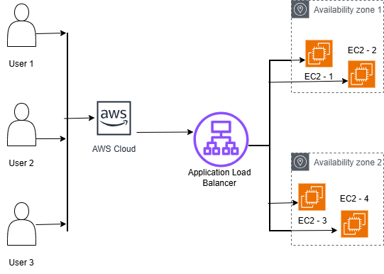

# Day 02 – AWS Global Infrastructure

## Course(s)
- Understanding AWS and its Global Infrastructure  
  Instructor: David Blocher  
  Platform: Pluralsight (Sep 2024)

- AWS Foundations (selected sections)  
  Instructor:   
  Platform: Pluralsight

---

## What is AWS Global Infrastructure?
### - Definition of AWS global infrastructure

AWS global infrastructure is Amazon's worldwide network of interconnected datacenters and points of presence designed to deliver scalable, secure, and low-latency cloud services globally, built around core components called Regions and Availability Zones (AZs) for high availability and disaster recovery

### - Why AWS operates infrastructure globally

AWS operates globally to provide:
1. Low-latency performance
2. High availability and disaster recovery
3. Massive scalability
4. Global reach
5. Meet strict data sovereinty/compliance needs

### - How global infrastructure supports scalability and resilience

Global infrastructure supports scalability and resilience through the its layered nature. Regions contain multiple isolated Availability Zones and datacenters with near-limitless capacity. Regions are geographically separate, and each has multiple AZs with unique power, cooling and networking, acting as independent failure domains.

---

## AWS Regions
- What an AWS Region is

An AWS Region is a physical geographic location worldwide where Amazon Web Services clusters its data centers, designed to keep services close to users, ensure high availability with multiple isolated Availability Zones (AZs) (each with independent power/cooling), and meet data residency requirements
- Why regions are geographically isolated

 Regions are geographically isolated to provide fault tolerance, stability, compliance (like GDPR - General Data Protection Regulation), and data sovereignty by ensuring independent power, networks, and physical separation, so an event in one region (like a natural disaster) doesn't affect others, letting businesses meet strict data residency laws and reduce latency by locating services near users. 
- Examples of AWS regions

#### North America
    - US East (N. Virginia): us-east-1
    - US East (Ohio): us-east-2
    - US West (Oregon): us-west-2
    - US West (N. California): us-west-1
    - Canada (Central): ca-central-1
    - Canada West (Calgary): ca-west-1 (Opt-in) 
#### Europe
    - Europe (Ireland): eu-west-1
    - Europe (Frankfurt): eu-central-1
    - Europe (London): eu-west-2
    - Europe (Paris): eu-west-3
    - Europe (Stockholm): eu-north-1
    - Europe (Milan): eu-south-1 (Opt-in)
    - Europe (Spain): eu-south-2 (Opt-in)
    - Europe (Zurich): eu-central-2 (Opt-in) 
#### Asia Pacific 
    - Asia Pacific (Tokyo): ap-northeast-1
    - Asia Pacific (Seoul): ap-northeast-2
    - Asia Pacific (Singapore): ap-southeast-1
    - Asia Pacific (Sydney): ap-southeast-2
    - Asia Pacific (Mumbai): ap-south-1
    - Asia Pacific (Jakarta): ap-southeast-3 (Opt-in)
    - Asia Pacific (Osaka): ap-northeast-3
    - Asia Pacific (Hong Kong): ap-east-1 (Opt-in) 
#### Middle East & Africa
    - Middle East (Bahrain): me-south-1 (Opt-in)
    - Middle East (UAE): me-central-1 (Opt-in)
    - Africa (Cape Town): af-south-1 (Opt-in) 
#### South America
    - South America (São Paulo): sa-east-1 
#### China (Requires specific setup) 
    - China (Beijing): cn-north-1
    - China (Ningxia): cn-northwest-1 
#### Government (Restricted)
    - AWS GovCloud (US-East): us-gov-east-1
    - AWS GovCloud (US-West): us-gov-west-1
- When and why to choose a specific region

You choose an AWS Region based on proximity to users (latency), data residency/compliance rules, service availability, and cost, balancing a fast user experience (closer region) with legal needs and budget, ensuring the chosen region supports your app's needed features and offers competitive pricing

### Canada Focus
- ca-central-1 (Montreal)
- Latency benefits for Canadian users
- Data residency and compliance considerations

---

## Availability Zones (AZs)
- What an Availability Zone is

An Availability Zone (AZ) is a physically isolated, independent data center location within an AWS Region, featuring its own power, cooling, and networking, designed to be fault-tolerant and protect against failures in other zones, allowing you to build highly available, resilient applications across separate facilities.
- Relationship between AZs and data centers

Hierarchy: Data Centers form AZs, and multiple AZs form a Region (e.g., AWS Region, Azure Region).


Isolation: Data centers within an AZ are physically separate, as are the AZs themselves, protecting against localized disasters.


Connectivity: Data centers within an AZ and AZs within a Region are linked by high-bandwidth, low-latency, redundant fiber networks, allowing for synchronous replication and failover.


Purpose: AZs abstract physical infrastructure to provide cloud users with reliable, scalable, and disaster-proof environments, allowing workloads to run across multiple AZs for resilience. 

- How AZs improve fault tolerance

Availability Zones (AZs) improve fault tolerance by providing physically separate data centers within a cloud region, allowing you to distribute applications and data across them; this redundancy ensures that a failure (like power loss, fire, or flood) in one AZ doesn't take down your entire system, as other AZs remain operational and can automatically take over traffic, keeping services available and minimizing downtime through replication, load balancing, and automatic failover. 


- Difference between single-AZ vs multi-AZ architectures

Single-AZ is cheaper, runs in one location, offers low latency but no automatic failover (high downtime risk), while Multi-AZ replicates across different Availability Zones (AZs) for high availability, automatic failover, and disaster recovery, but at a higher cost, providing better resilience for critical apps. Think Single-AZ for dev/test, Multi-AZ for production

---

## Edge Locations
- What edge locations are

 Edge Locations are strategically placed data centers worldwide that bring content and services closer to end-users, reducing latency and speeding up delivery, primarily for services like Amazon CloudFront (CDN) and Route 53 (DNS) by caching data and resolving requests locally. Unlike larger Regions, they focus on performance and speed, serving as the network's frontline to deliver fast experiences for websites, videos, and applications. 


- Purpose of edge locations (low latency)

Edge locations, which are smaller data centers near users, reduce latency by bringing content and processing closer to them, making apps faster for gaming, streaming, and e-commerce; they cut down data travel time, improving user experience and enabling real-time services by serving cached content and handling requests locally instead of sending everything to distant main clouds. 


- Relationship to Amazon CloudFront

Amazon CloudFront's edge locations are a worldwide network of data centers that form the core infrastructure of its content delivery network (CDN) service. Their primary relationship is to store and deliver cached content to end-users with the lowest possible latency, significantly improving performance and reducing the load on origin servers. 


- Difference between edge locations and regions

AWS Regions are large, isolated geographic areas with multiple data centers (AZs) for core, resilient services, while Edge Locations are many smaller, globally distributed points of presence (PoPs) primarily for caching content (via CloudFront) to deliver it super fast (low latency) to users worldwide, acting as the closest entry point for data. Regions focus on redundancy and complete infrastructure, whereas Edge Locations focus purely on speed and content delivery. 

---

## How AWS Achieves High Availability
- Region-level isolation
- Multi-AZ design
- Load balancing across AZs
- Service redundancy

---

## Architecture Example
- Description of a highly available application

Traffic from users is routed through an Application Load Balancer to EC2 instances distributed across two Availability Zones. Each AZ contains multiple EC2 instances to provide horizontal scalability and fault tolerance. This ensures high availability and resilience against both instance-level and AZ-level failures
- Components used (ALB, EC2, AZs)



#### Diagram: Traffic flow from user to application
---

## IAM Overview (Foundations Preview)
- What IAM is
- Why IAM is critical for security
- Core components:
  - Users
  - Groups
  - Roles
  - Policies

---

## Hands-On (CLI )

## AWS Compute Fundamentals – Hands-on Summary

### Objective
- Provision an EC2 instance on AWS
- Establish secure SSH access from a Windows machine
- Transfer files from local system to EC2 using SCP

### Environment
- **Local OS:** Windows 11
- **Shells:** Windows PowerShell, Ubuntu (WSL2)
- **Cloud Provider:** AWS
- **Instance OS:** Amazon Linux 2023
- **Authentication:** SSH key pair (`.pem`)

### EC2 Provisioning
- Created an EC2 instance via AWS Management Console
- Selected Amazon Linux 2023 AMI
- Associated an SSH key pair
- Configured Security Group to allow SSH (port 22)
- Obtained public IPv4 address for remote access

### Secure SSH Access
- Connected to EC2 using SSH from PowerShell:
  ```powershell
  ssh ec2-user@<public-ip> -i myfirstec2instancekeypair.pem

- Verified successful login and home directory access

- Remote Directory Setup

- Created a target directory on EC2 to receive files:

 ```mkdir scptarget ```

- Local File Preparation

- Created multiple text files on Windows:

 ```Hello1.txt → Hello6.txt ```

- Verified file existence and contents locally

- File Transfer with SCP

- Copied files from Windows to EC2 using SCP over SSH:

 ```scp -i myfirstec2instancekeypair.pem Hello*.txt ec2-user@<public-ip>:~/scptarget/  ```


- Observed successful encrypted file transfer

- Verification

- Reconnected to EC2 via SSH

- Confirmed files were present in target directory:

 ```cd scptarget && ls  ```


## Key Concepts Learned

- EC2 instances are accessed using SSH key-based authentication

- SSH keys are reused for both remote access and secure file transfer

- SCP operates over SSH, ensuring encrypted data in transit

- File transfer can be performed without interactive login

This workflow is foundational for DevOps automation and CI/CD pipelines
- Commands executed:
  - aws iam list-users
  - aws iam list-roles
  - aws ec2 describe-regions
  - aws ec2 describe-availability-zones --region ca-central-1
- Observations from command outputs

---

## Reflection
- Why AWS designs its infrastructure this way
- How regions and AZs influence application availability
- How this knowledge helps in cloud engineering and DevOps roles

---

## Key Takeaways
- Global infrastructure is the foundation of AWS services
- Region and AZ choices directly affect reliability and performance
- High availability is designed, not accidental
